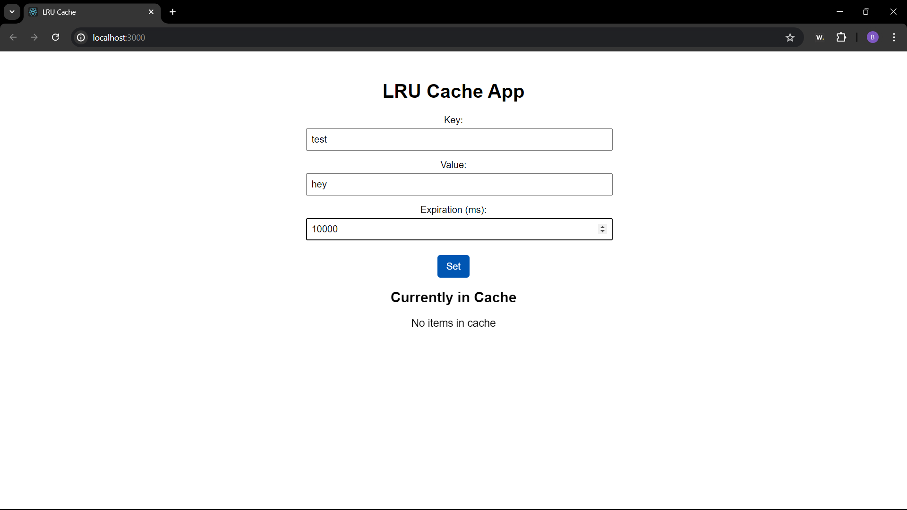
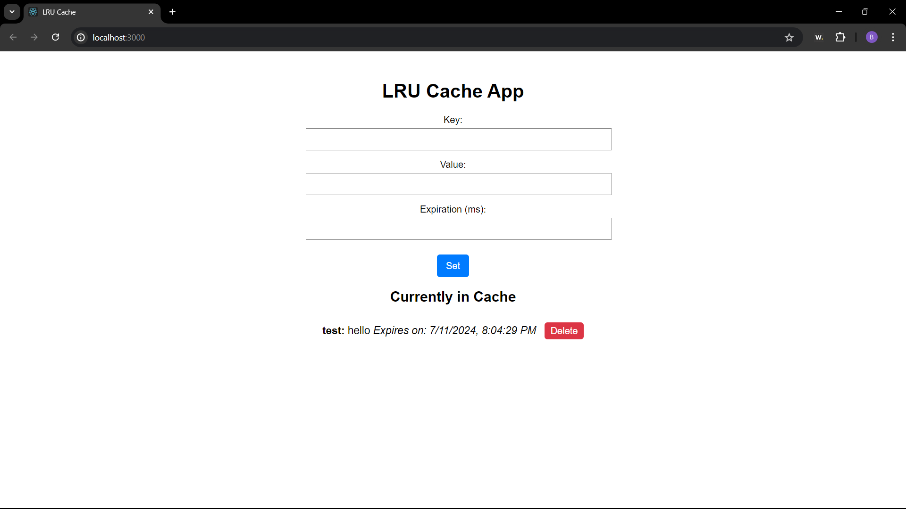

# LRU Cache with WebSocket Notifications

## Overview

An LRU (Least Recently Used) cache with a backend server in Go and a frontend application in React. The Go backend provides APIs for cache operations and uses WebSockets to notify clients of cache changes. The React frontend interacts with the backend to display and manage cache data.

## Features

- **LRU Cache**: Efficiently stores and manages key-value pairs with expiration support.
- **REST APIs**:
  - `POST /cache`: Add or update a cache item.
  - `DELETE /cache/:key`: Remove a cache item.
  - `GET /cache`: Retrieve all cache items.
- **WebSocket Notifications**: Clients receive real-time updates on cache changes (set/delete operations).
- **React Frontend**: A user-friendly interface to interact with the cache.

### Prerequisites

- Go (1.18+)
- Node.js (14+)
- npm or yarn

### Backend Setup

1. **Clone the repository:**

   ```bash
   git clone https://github.com/yourusername/lru-cache.git
   cd lru-cache
   ```

2. **Navigate to the backend directory:**

   ```bash
   cd backend
   ```

3. **Install Go dependencies:**

   ```bash
   go mod tidy
   ```

4. **Run the backend server:**

   ```bash
   go run main.go
   ```

   The server will start on `http://localhost:8080`.

### Frontend Setup

1. **Navigate to the frontend directory:**

   ```bash
   cd ../frontend
   ```

2. **Install Node.js dependencies:**

   ```bash
   npm install
   ```

3. **Run the React development server:**

   ```bash
   npm start
   ```

   The frontend will be available at `http://localhost:3000`.

## Frontend Application

The React application provides a form to add or update cache items and displays the current cache state. You can also delete cache items through the interface.

### Screenshots

**Cache Management Form:**


**Cache State Display:**

